# Regalé Couture

Developed as part of a milestone project 4 for Code Institute.

  

[View the deployed website here](https://regale-couture-9bf4ffa1e14c.herokuapp.com/)

## Table of contents

* [`User Experience`](#user-experience-ux)
  * [`User Stories`](#user-stories)

* [`Design`](#design)
  * [`Colour Scheme`](#colour-scheme)
  * [`Typography`](#typography)
  * [`Imagery`](#imagery)
  * [`Wireframes`](#wireframes)
  * [`Features`](#features)
    * [`Desktop`](#desktop)
    * [`Mobile`](#mobile)
    * [`Future Implementations`](#future-implementations)
  * [`Accessibility`](#accessibility)

* [`Technologies Used`](#technology)
  * [`Languages Used`](#languages-used)
  * [`Frameworks, Libraries & Programs Used`](#frameworks--programs-used)

* [`Deployment & Local Development`](#deployment--local-development)
  * [`Deployment`](#deployment)
  * [`Local Development`](#local-development)
    * [`How to Fork`](#how-to-fork)
    * [`How to Clone`](#how-to-clone)

* [`Testing`](#testing)
  
* [`Credits`](#credits)
  * [`Code Used`](#code-credits)

## User Experience (UX)

### Key information for the site

1. Wide product variety across multiple categories.
2. User-friendly interface for seamless navigation.
3. Personalized user accounts for a tailored experience.
4. Promotions and discounts to attract and engage customers.
5. Secure checkout and account protection for trust and confidence.

### User Stories

* As a *Shopper* I want to...
  * View a list of products
  * View a specific category of products
  * View individual product details
  * Quickly identify deals, clearance items, and special offers
  * Easily view the total of my purchases at any time
* So that I can...
  * Select some to purchase
  * Quickly find products I'm interested in without having to search through all products
  * Identify the price, description, product rating, product image, and available sizes.
  * Take advantage of special savings on products I'd like to purchase
  * Avoid spending too much

* As a Site *User* I want to...
  * Easily register for an account
  * Easily login or logout
  * Easily recover my password in case I forget it
  * Receive an email confirmation after registering
  * Have a personalized user profile
* So that I can...
  * Have a personal account and be able to view my profile
  * Access my personal account information
  * Recover access to my account
  * Verify that my account registration was successful
  * View my personal order history and order confirmations and save my payment information

* As a *Shopper* I want to...
  * Sort the list of available products
  * Sort a specific category of product
  * Sort multiple categories of products simultaneously
  * Search for a product by name or description
  * Easily see what I've searched for and the number of results
* So that I can...
  * Easily identify the best-rated, best-priced, and categorically sorted products
  * Find the best-priced or best-rated product in a specific category or sort the products in that category by name
  * Find the best-priced or best-rated products across broad categories, such as "clothing" or "bags"
  * Find a specific product I'd like to purchase
  * Quickly decide whether the product I want is available

* As a *Shopper* I want to...
  * Easily select the size and quantity of a product when purchasing it
  * View items in my bag to be purchased
  * Adjust the quantity of individual items in my bag
  * Easily enter my payment information
  * Feel my personal and payment information is safe and secure
  * View an order confirmation after checkout
  * Receive an email confirmation after checking out
* So that I can...
  * Ensure I don't accidentally select the wrong product, quantity, or size
  * Identify the total cost of my purchase and all items I will receive
  * Easily make changes to my purchase before checkout
  * Check out quickly and with no hassles
  * Confidently provide the needed information to make a purchase
  * Verify that I haven't made any mistakes
  * Keep the confirmation of what I've purchased for my records

* As a Site *Owner* I want to...
  * Add a product
  * Edit/update a product
  * Delete a product
* So that I can...
  * Add new items to my store
  * Change product prices, descriptions, images, and other product criteria
  * Remove items that are no longer for sale.

- - -

## Design

### Colour Scheme

* The store follows a black **(#000)** and white **(#FFF)** approach and those are the main colors used throughout the page. Incorporated from the Hugo Boss website, those colors creates a subtle and calming effect on the eyes of the reader, making it easier to read and process the content on the website.

  * 

### Typography

Google Fonts was used throughout the whole page:

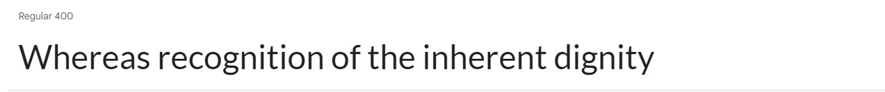

* **Lato** font was used because it has a modern and professional look, making it suitable for an e-commerce application that aims to provide a clean and polished user interface while ensuring that the text is easily readable.

### imagery

This website has product images present and a background photo.

### Wireframes

* **Desktop** - Home

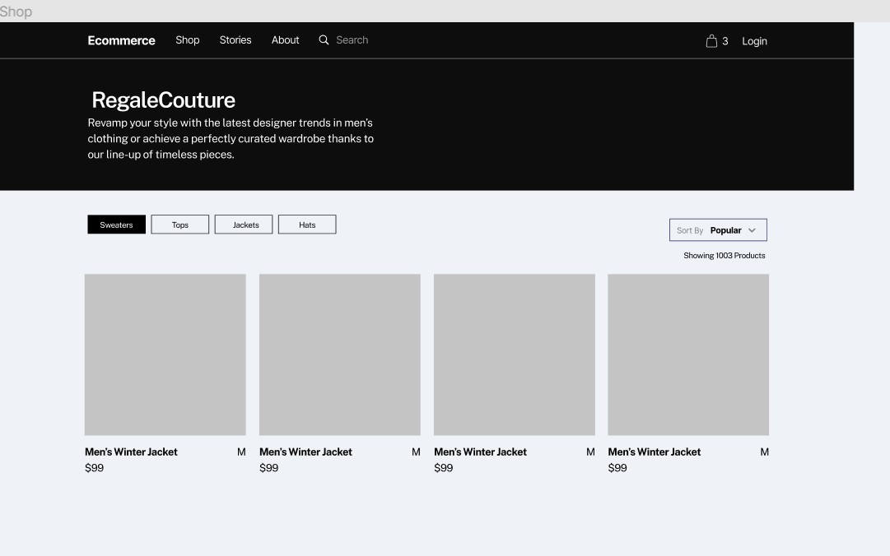

* **Desktop** - Sign Up

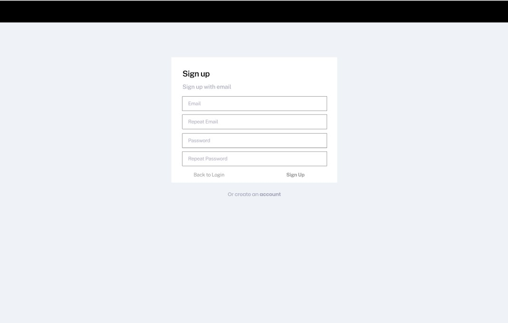

* **Desktop** - Login

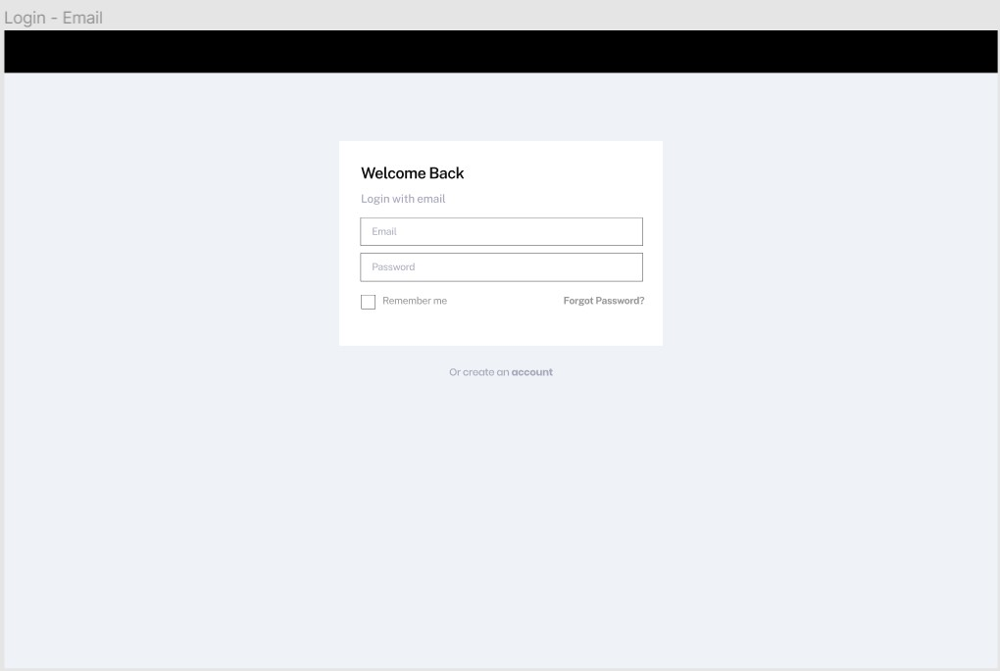

* **Desktop** - Products

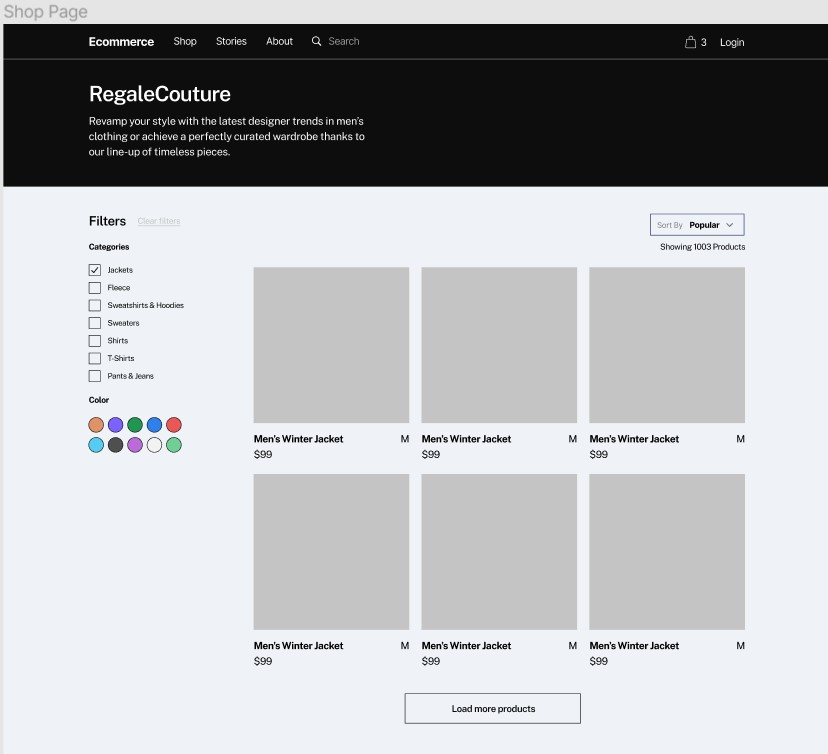

* **Desktop** - Checkout

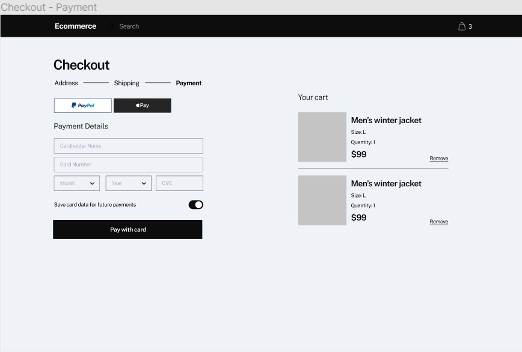

* **Desktop** - Product Detail

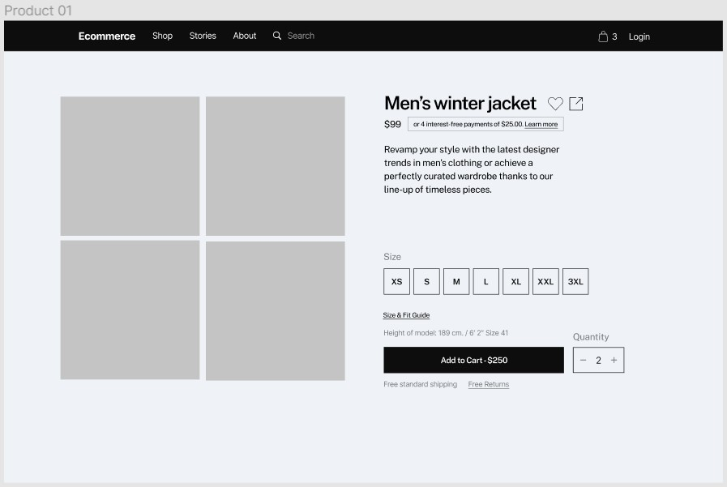

* **Desktop** - Bag

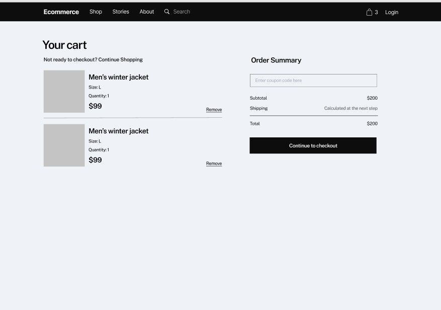

## Features

The page consists of the base template, home, edit_product, add product, login, sign up, checkout, profile, bag, and allauth templates where all features and content are present & responsive.

### Desktop

* The Homepage:

  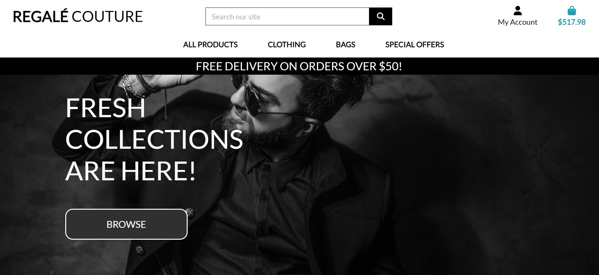

* The shopping bag:

  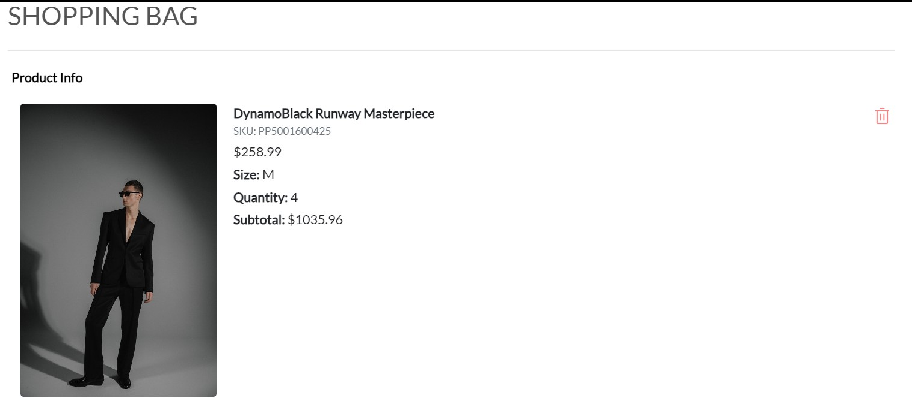

* Checkout page:

  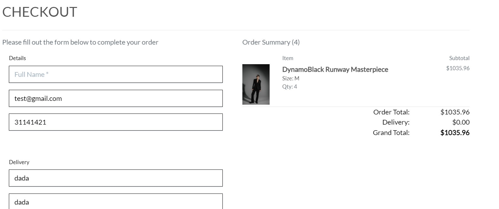

* Products:

  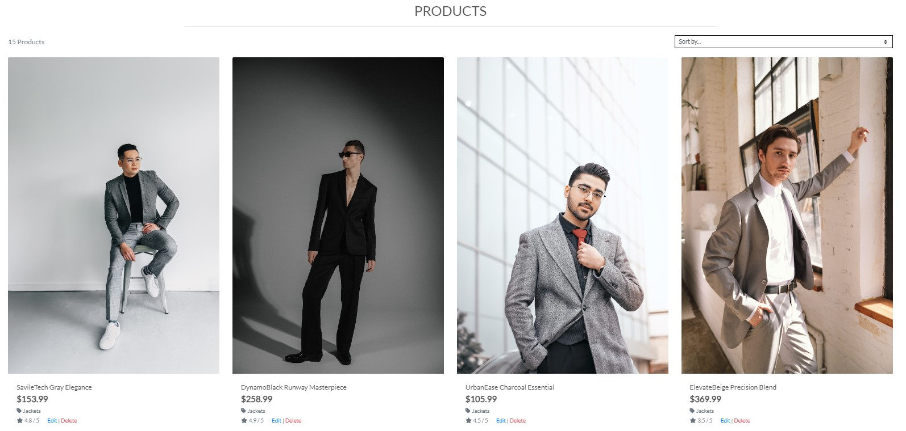

* Product detail:

  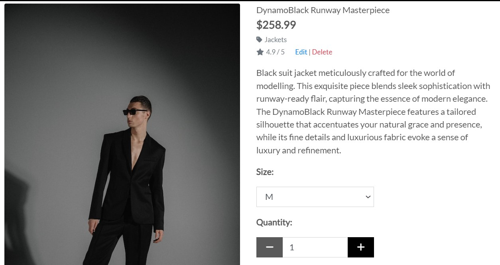

* Profile:

  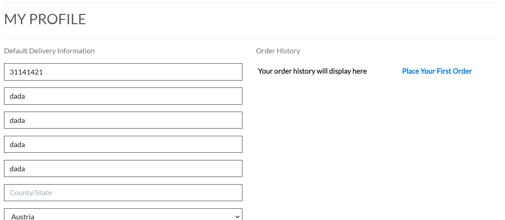

* Login:

  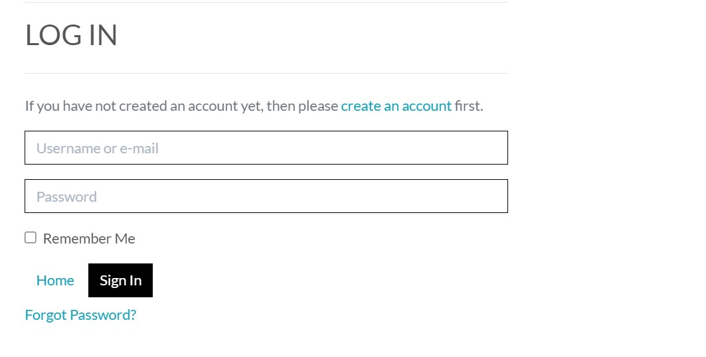

* Sing Up:

  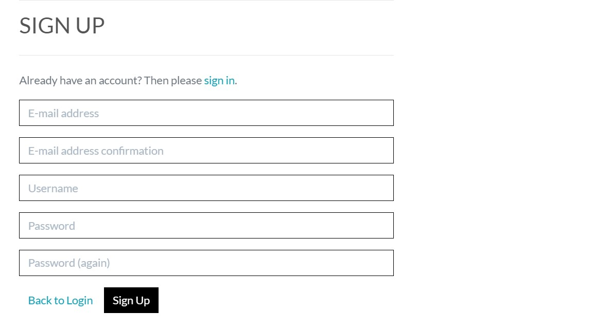

### Mobile

* The Homepage:

  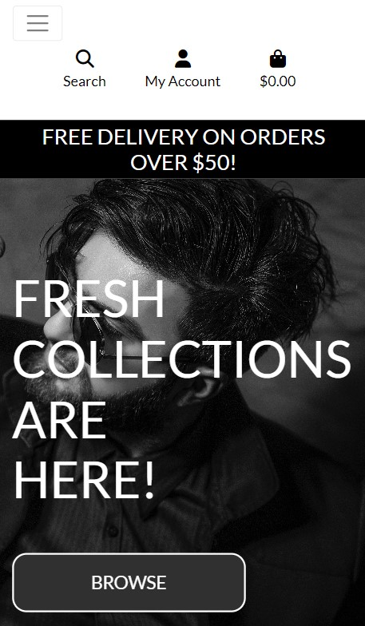

* The shopping bag:

  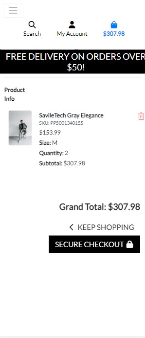

* Checkout page:

  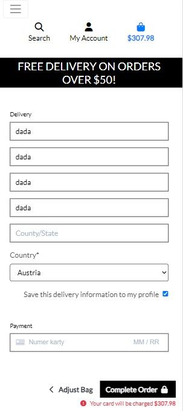

* Products:

  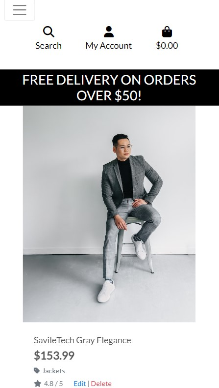

* Product detail:

  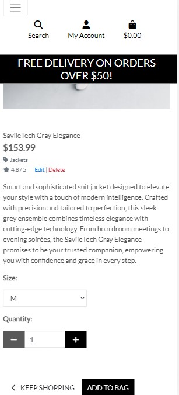

* Profile:

  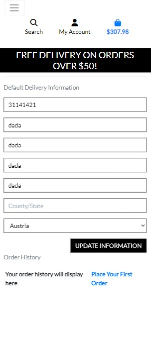

* Login:

  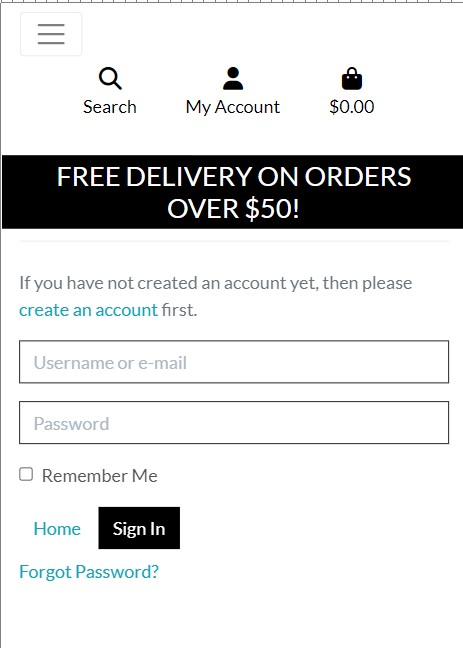

* Sing Up:

  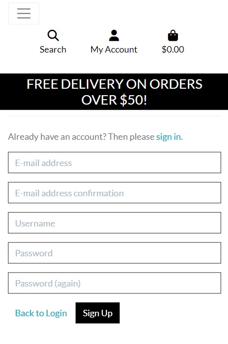

### Future Implementations

1. I would integrate voice-activated shopping, allowing customers to browse and purchase products using simple voice commands. This would provide a convenient and hands-free shopping experience, making it easier for customers to find and buy the items they need.

2. sRecognizing the power of social media, I would integrate social commerce features into my e-commerce page. This would allow customers to seamlessly discover and purchase products through popular social media platforms, leveraging user-generated content and social proof to drive sales and expand my brand's reach.

3. Given the growing dominance of mobile devices, I would prioritize enhancing mobile commerce on my e-commerce page. This would involve implementing mobile-friendly features such as one-tap checkout, mobile wallets, and interactive mobile experiences like augmented reality try-on capabilities. By optimizing for mobile, I would ensure a seamless and enjoyable shopping experience for my customers on the go.

4. Chatbot Assistance: I would implement a chatbot feature on my e-commerce page to provide instant customer support and assistance. The chatbot could help customers with common queries, provide product recommendations, and facilitate the purchase process. This would enhance the overall customer experience and improve responsiveness, even outside of regular business hours.

5. Quick View Product Preview: To streamline the browsing experience, I would incorporate a quick view feature that allows customers to preview product details, including images, pricing, and key specifications, without leaving the current page. This would save customers time and effort, enabling them to make faster purchase decisions and navigate through products more efficiently.

- - -

### Accessibility

It was ensured that the website is accessible and as user-friendly as possible. I have achieved this by:

* Using semantic HTML.
* Following heading hierarchy.
* Implementing *Tab* friendly navigation for links.
* Using hover effects on all buttons and links to inform the user they are hovering on a button.
* Complying with colour contrast guidelines (Aa).

- - -

## Technology

### Languages Used

 HTML, CSS, JavaScript, and Python were used for this project.

### Frameworks & Programs Used

* [Django](https://www.djangoproject.com/) User as a base for development.

* [jQuery](https://jquery.com/) As JavaScript library.

* [Jinja](https://jinja.palletsprojects.com/en/3.1.x/) As template engine.

* [ElephantSQL](https://www.elephantsql.com/) Manage database.

* [Figma](https://www.figma.com/) For wireframes.

* [Git](https://git-scm.com/) As version control.

* [GitHub](https://github.com/) To save and store the files for the website.

* [GitPod](https://gitpod.io) IDE used to create the site.

* [Heroku](https://heroku.com) For deployment.

* [Google Fonts](https://fonts.google.com/) To import the fonts used on the website.

* [Bootstrap](https://getbootstrap.com/) For style.

* [Font Awesome](https://fontawesome.com/) For the iconography on the website.

* [Google Dev Tools](https://developer.chrome.com/docs/devtools/) For troubleshooting, testing features and solving issues with responsiveness and styling.

* [Coolors](https://coolors.co/) To generate colour palette.

* [Am I Responsive?](http://ami.responsivedesign.is/) To show the website image on a range of devices.

* [Bulma](https://bulma.io/) Icon.

- - -

## Testing

Please refer to [TESTING.md](TESTING.md) file for full testing procedure.

- - -

## Deployment & Local Development

### Deployment

GitHub Pages was used to deploy the live [adampl12/Regale-Couture](https://github.com/adampl2/Regale-Couture) website. Instructions:

1. Log in (or sign up) to Github.
2. Find the repository for this project, [adampl12/Regale-Couture](https://github.com/adampl2/Regale-Couture).
3. Click on the Settings link.
4. Click on the Pages link in the left-hand side navigation bar.
5. In the Source section, choose main from the drop-down select branch menu. Select Root from the drop-down select folder menu.
6. Click Save. Your live Github Pages site is now deployed at the URL shown.

### Local Development

#### How to Fork

Fork the Regale-Couture repository:

1. Log in (or sign up) to Github.
2. Go to the repository for this project, [adampl12/Regale-Couture](https://github.com/adampl2/Regale-Couture).
3. Click the Fork button in the top right corner.

#### How to Clone

Clone the Regale-Couture repository:

1. Log in (or sign up) to GitHub.
2. Go to the repository for this project, [adampl12/Regale-Couture](https://github.com/adampl2/Regale-Couture).
3. Click on the code button, select whether you would like to clone with HTTPS, SSH or GitHub CLI and copy the link shown.
4. Open the terminal in your code editor and change the current working directory to the location you want to use for the cloned directory.
5. Type 'git clone' into the terminal and then paste the link you copied in step 3. Press enter.

#### Running the Project

1. Once located in the Regale-Couture repository, click on the green gitpod button located on the right-hand side of the screen.
2. Once workspace opens, enter `python3 run.py` command in the terminal.
3. A pop-up window will appear. Click on "Make Public" to expose the server on a public URL.
4. Open a new browser window and navigate to the URL provided by Gitpod to view the website.
5. Use the website as intended and ensure that all features are functioning correctly.

- - -

## Credits

### Code Credits

* [Jigs1212](https://stackoverflow.com/questions/49407059/jquery-scroll-to-top-shows-the-button-without-scrolling-the-page) - Scroll to top button jQuery code.
* [boryanakrasteva](https://uiverse.io/boryanakrasteva/tidy-falcon-17) - Delete item button.
* [Cesar Canassa](https://stackoverflow.com/questions/849142/how-to-limit-the-maximum-value-of-a-numeric-field-in-a-django-model) - Fixed rating int out of range bug.
* [Konrad Wax](https://codepen.io/konradwax/pen/woPNqJ) - Browse button.

### Media Credits

* [Main bg photo](https://www.pexels.com/pl-pl/zdjecie/czlowiek-przy-selfie-432059/) - Main background photo.

* [Jacket pic1](https://www.pexels.com/pl-pl/zdjecie/mezczyzna-garnitur-siedzenie-model-8250140/) - Gray Jacket product.

* [Jacket pic2](https://www.pexels.com/pl-pl/zdjecie/mezczyzna-okulary-sloneczne-na-stojaco-pozowanie-16770813/) - Black Suit product.

* [Jacket pic3](https://www.pexels.com/pl-pl/zdjecie/moda-mezczyzna-w-szarym-plaszczu-11814795/) - Gray Coat product.

* [Jacket pic4](https://www.pexels.com/pl-pl/zdjecie/moda-mezczyzna-garnitur-sciana-9197291/) - Rosy Brown Coat product.

* [Jeans pic1](https://www.pexels.com/pl-pl/zdjecie/mezczyzna-ubrany-w-niebieskie-spodnie-jeansowe-914472/) - Dark Blue Jeans product.

* [Trousers pic2](https://www.pexels.com/pl-pl/zdjecie/schody-mezczyzna-osoba-garnitur-9102968/) - Suit Trousers black product.

* [Trousers pic3](https://www.pexels.com/pl-pl/zdjecie/mezczyzna-osoba-garnitur-dzentelmen-10580211/) - Black suit trousers product.

* [Trousers pic4](https://www.pexels.com/pl-pl/zdjecie/moda-okulary-sloneczne-stylowy-modny-11486677/) - Dark red trousers product.

* [Shirt pic1](https://www.pexels.com/pl-pl/zdjecie/mezczyzna-w-bialo-niebieskiej-koszuli-plaid-dress-769749/) - Checkered shirt product.

* [Shirt pic2](https://www.pexels.com/pl-pl/zdjecie/shallow-focus-zdjecie-mezczyzny-w-czarnej-koszulce-button-up-3133797/) - Shirt pic product.

* [Shirt pic3](https://www.pexels.com/pl-pl/zdjecie/mezczyzna-osoba-model-styl-5653897/) - White casual shirt product.

* [Shirt pic4](https://www.pexels.com/pl-pl/zdjecie/biznesmen-moda-mezczyzna-model-4892782/) - Casual white shirt product.

* [Bag pic1](https://www.pexels.com/pl-pl/zdjecie/zdjecie-osoby-niosacej-plecak-2452345/) - Small student bag.

* [Briefcase1](https://www.pexels.com/pl-pl/zdjecie/biznesmen-mezczyzna-na-stojaco-niosacy-4965149/) - Briefcase1 product.

* [Wireframes](https://www.figma.com/community/file/966016571279781800/Ecommerce-Wireframe-Kit) - For wireframes.
