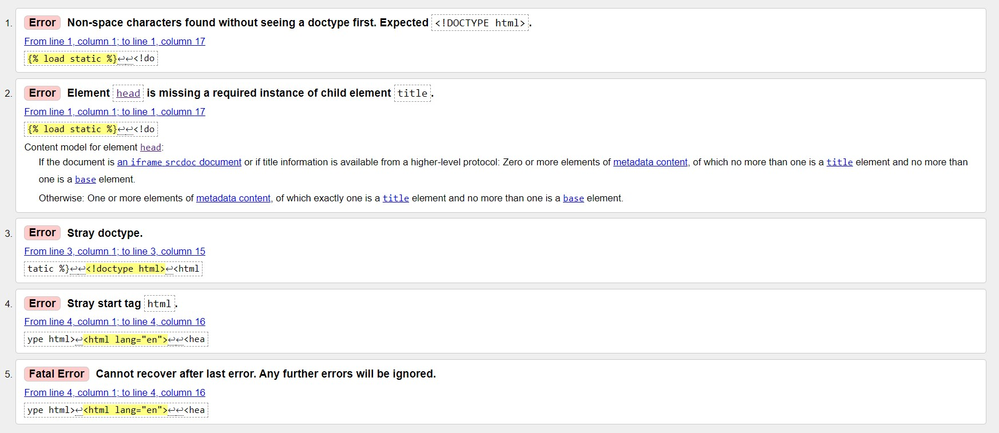
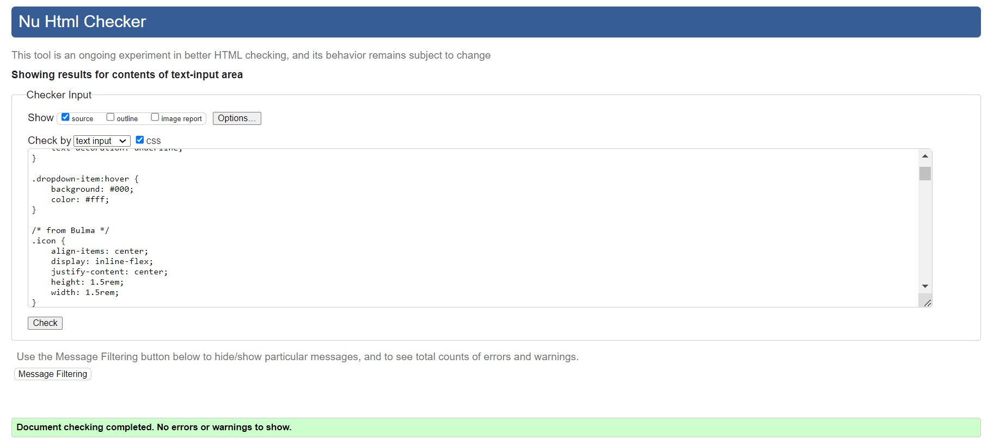

# Regalé-Couture - Testing

[View deployed site here]()

- - -

## CONTENTS

* [`Automated Testing`](#automated-testing)
  * [`W3C Validator`](#w3c-validator)
  * [`JavaScript Validator`](#javascript-validator)
  * [`Lighthouse`](#lighthouse)
* [`Manual Testing`](#manual-testing)
  * [`User Stories`](#user-stories)
  * [`Full Testing`](#full-testing)

Testing progressed at every stage of this project. This ensured that most issues were fixed before the website was finished. Chrome DevTools were utilised when building the website to help with troubleshooting as the website transformed.

## Automated Testing

### W3C Validator

The [W3C validator](https://validator.w3.org/) was used to validate the HTML and CSS pages.

* HTML Validation

* base.html:

   - Unsuccessful

* CSS Validation
  * 

- - -

### JavaScript Validator

[jshint](https://jshint.com/) was used to validate all JavaScript code on this page.